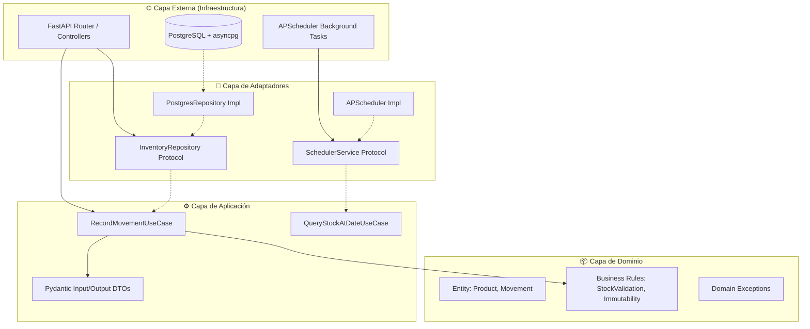

# AGENTS.md
> **Nota:** Este documento es la fuente de verdad arquitectónica del proyecto. Toda implementación debe alinearse estrictamente con estas directrices. Para el orden de ejecución y trazabilidad de specs, consultar `WORKFLOW.MD`.

---
## 🎯 Contexto del Proyecto

### Descripción MVP y Propósito
Desarrollar un sistema de gestión de inventario basado en el principio de **Source of Truth Inmutable**, donde cada entrada/salida se registra como un movimiento atómico e inalterable. El sistema debe permitir consultar el stock exacto en cualquier fecha histórica (`stock @ date`) cumpliendo un SLA de `<100ms` mediante vistas materializadas optimizadas. El MVP demostrará competencia en arquitectura orientada a datos, patrones de inmutabilidad, y separación estricta de responsabilidades.

### Requisitos Funcionales vs No Funcionales

| Requisito Funcional                                  | Requisito No Funcional                           | Justificación Arquitectónica                              |
| ---------------------------------------------------- | ------------------------------------------------ | --------------------------------------------------------- |
| Registro inmutable de movimientos (entradas/salidas) | `<100ms` en consultas analíticas base            | Materialized Views + índices parciales                    |
| Cálculo de stock en fecha `X`                        | Integridad referencial ACID estricta             | Foreign Keys + Constraints DB                             |
| API REST versionada `/v1/`                           | Trazabilidad 100% auditables                     | Append-Only log + `created_at` indexing                   |
| Scheduler interno para refresh de vistas             | Zero-hardcode, config externalizada              | `.env` + Pydantic Settings                                |
| Contrato OpenAPI auto-documentado                    | Testcontainers para fidelidad DB real            | `pytest` + `testcontainers.postgres`                      |
### Dominio y Límites del Sistema
- **Incluido:** Entidades `Product`, `Movement`, `StockSnapshot` (calculado), APIs REST, Scheduler APScheduler, Testcontainers.
- **Excluido:** Autenticación/OAuth, UI Web, microservicios distribuidos, pasarelas de pago.
- **Fronteras:** El dominio de inventario es el límite principal. La base de datos actúa como adaptador de infraestructura, no como contenedor de lógica de negocio.

---
## 🏗️ Arquitectura y Diseño

### Patrón Arquitectónico: Clean Architecture + Ports & Adapters
El sistema sigue estrictamente la **Dependency Inversion Principle (DIP)**. Las dependencias de código fuente apuntan siempre hacia el centro (Dominio/Aplicación). PostgreSQL, FastAPI y APScheduler son detalles externos intercambiables.



### Estrategia de Comunicación y Estado
- **Comandos (Write):** Se envían a `RecordMovementUseCase`. Validan reglas de negocio (stock no negativo, tipo de movimiento válido) y delegan al repositorio.
- **Consultas (Read):** `QueryStockAtDateUseCase` lee de la vista materializada `mv_stock_historical`. Si la vista no está lista, fallback a cálculo directo con límite de paginación.
- **Manejo de Concurrencia:** Optimistic Concurrency con reintentos exponenciales en la capa de aplicación. Se utiliza `version` transaccional o aislamiento `READ COMMITTED` + retry en `asyncpg`.

### Justificación Técnica
- **SQL Explícito:** Permite control total sobre `EXPLAIN ANALYZE`, índices compuestos y CTEs. Se evita la capa de abstracción ORM para no ocultar planes de ejecución.
- **FastAPI + Pydantic:** Generación nativa de OpenAPI 3.0. Validación estricta de contratos en entrada/salida sin boilerplate.
- **APScheduler Interno:** Simplifica el despliegue monolítico MVP. El refresh se ejecuta como `BackgroundTask` o cron job ligero, aislado del ciclo request/response.

---
## 🔧 Guías de Desarrollo

### Principios SOLID y Ortogonalidad Aplicados
1. **SRP:** Cada archivo cumple una única responsabilidad. `repositories.py` solo maneja I/O de datos. `use_cases.py` solo orquesta lógica.
2. **OCP:** Nuevos tipos de movimientos se añaden extendiendo clases o enums, no modificando condicionales existentes.
3. **LSP:** Las implementaciones de repositorio deben ser sustituibles por mocks sin alterar contratos Pydantic.
4. **DIP:** Los casos de uso dependen de protocolos (`abc.ABC` o `typing.Protocol`), no de `asyncpg` directamente.
5. **ISP:** Interfaces granulares (`IMovementRepository`, `IStockQueryRepository`). No se exponen métodos `delete` si el dominio requiere inmutabilidad.

### Patrones de Diseño
- **Repository Pattern:** Abstrae el acceso a PostgreSQL. Expone métodos semánticos: `create_movement()`, `get_stock_at_date()`.
- **Unit of Work:** Gestión explícita de transacciones vía `asyncpg.transaction()`. Commit/Rollback determinístico.
- **Humble Object:** La lógica compleja reside en SQL puro (vistas, CTEs). Python solo valida, mapea y coordina.
- **Strategy (Refresh):** El scheduler inyecta la política de refresco. Permitirá swapping futuro a Celery/RQ sin tocar dominio.

### Convenciones y Estructura
```
src/
├── domain/          # Entidades, excepciones, reglas de negocio puras
├── application/     # UseCases, DTOs, Interfaces (Protocols)
├── infrastructure/  # FastAPI routers, asyncpg wrappers, APScheduler config
├── adapters/        # Repositorios concretos, mapeo SQL<->DTO
└── main.py          # DI Container, setup, entrypoint
tests/
├── unit/            # Mocked protocols, pure business logic
├── integration/     # Testcontainers, SQL real, endpoints
└── e2e/             # Flujos completos, load testing básico
```

### Checklist Pre-Commit
- [ ] Linter (`ruff`) sin warnings críticos.
- [ ] Formato (`black`/`isort`) aplicado.
- [ ] Tests unitarios passing (`>80%` cobertura dominio).
- [ ] Migraciones/queries validadas con `EXPLAIN` en staging local.
- [ ] No hardcode, no `print()` en producción, loggers configurados.

### Manejo de Errores y Fallbacks
- **Errores DB:** Captura explícita de `asyncpg.PostgresError`. Mapeo a `HTTP 4xx/5xx` o excepciones de dominio (`InsufficientStockError`).
- **Timeouts:** `statement_timeout=5s` en queries analíticas. Fallback a respuesta cached o `503 Service Unavailable`.
- **Reintentos:** Decorador `@retry` con backoff exponencial para conflictos de concurrencia.

---
## 🧪 Testing y Calidad

### Estrategia en 3 Fases
1. **Unitarias:** Validan lógica de negocio pura y mapeo DTOs. Sin DB real. Usan `unittest.mock` o `pytest-mock` contra protocolos.
2. **Integración:** Levantan PostgreSQL efímero con `testcontainers.postgres`. Ejecutan scripts SQL de migración, insertan fixtures, validan resultados de vistas y queries.
3. **E2E / Contract:** Lanzan servidor FastAPI en modo test. Simulan requests HTTP, validan respuestas JSON contra esquemas Pydantic y miden latencia `<100ms`.

### Frameworks y Patrones
- **Pytest + pytest-asyncio:** Estándar para código asíncrono.
- **Factory Boy:** Generación determinista de fixtures de prueba.
- **SQLAlchemy Core (solo para tests):** Uso opcional para seed data rápido sin comprometer la capa de prod.
- **Aislamiento:** Cada test suite transaccional. Rollback automático post-test. Contenedores destruidos al finalizar CI.

### Métricas de Calidad
- **Cobertura:** `>85%` en `domain/` y `application/`. `>70%` en `infrastructure/`.
- **Complejidad Ciclomática:** `<10` por función. Si supera, refactorizar con SRP.
- **Deuda Técnica:** Cero `FIXME` o `TODO` críticos en rama `main`. SonarQube/Qodana clean.

### Mockeo y Aislamiento
- **DB Mocking:** En unit tests, inyectar `MockRepository` que retorna `AsyncMock`.
- **Scheduler Mocking:** `APScheduler` se desactiva en modo `TESTING`. Se verifica registro de jobs, no ejecución real.
- **Time Mocking:** `freezegun` para validar consultas históricas deterministas.

---
## 🔒 Seguridad y Prohibiciones

### Validación y Sanitización
- **Inputs:** Pydantic valida tipos, rangos, formatos UUID/ISO8601. Rechazo automático de payloads malformados (`HTTP 422`).
- **SQL Injection:** Zero tolerancia. Uso estricto de parámetros posicionales/nombrados (`$1, $2`). Nunca concatenación de strings para queries.
- **Secretos:** `.env` nunca versionado. Variables sensibles cargadas vía `pydantic-settings`. Rotación automática en CI.

### Control de Excepciones y Límites
- **Rate Limiting:** Middleware básico en FastAPI (`slowapi` o manual) para endpoints de lectura masiva.
- **Deadlines:** Timeouts explícitos en `asyncpg.connect()`. Circuit breaker implícito vía retry limits.
- **Logging:** Estructurado (JSON). Nunca loggear datos sensibles o stacks completos en prod.

### 🚫 Lista Explícita de Prácticas Prohibidas
1. ❌ **Hardcoded credentials, URLs o queries SQL en código.**
2. ❌ **Side-effects ocultos:** Funciones que leen/escriben a la DB sin ser declaradas como tal.
3. ❌ **Acoplamiento temporal:** Lógica que depende del orden de ejecución implícito de imports o módulos globales.
4. ❌ **God Objects / Fat Controllers:** Clases >300 líneas o funciones con múltiples responsabilidades.
5. ❌ **ORM para queries analíticas complejas:** Usar SQLAlchemy ORM para CTEs/Window Functions está prohibido.
6. ❌ `print()` en producción. Usar `logging` o `structlog`.
7. ❌ **Ignorar `async/await`:** Mezclar código síncrono en rutas async bloquea el event loop.
8. ❌ **Modificar datos históricos:** `UPDATE` o `DELETE` en tabla `movements`. Solo `INSERT`. Si hay error, insertar movimiento compensatorio.

---
> 📖 **Referencia de Estándares:** Este documento aplica principios de *Clean Architecture* (Martin), *Clean Code* (Robert C. Martin), y metodologías *Spec-Driven* validadas. La trazabilidad completa se gestiona en `WORKFLOW.MD`.

