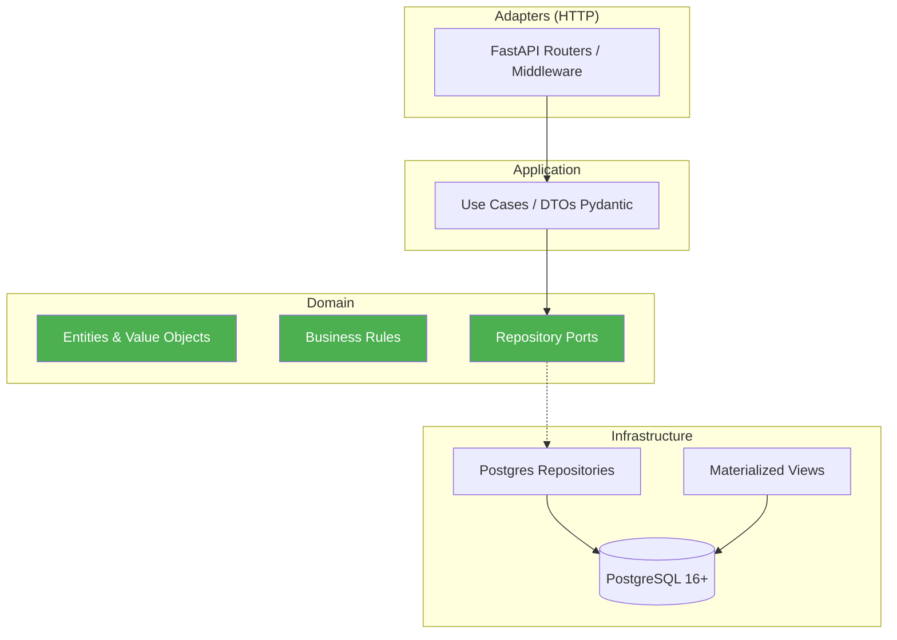

# Stock Historial

[](https://github.com/Fisherk2/esquema-stock-historial/actions/workflows/ci.yml)
[](https://github.com/Fisherk2/esquema-stock-historial)
[](https://www.python.org/downloads/)
[](LICENSE)

Sistema de gestión de inventario con **Source of Truth Inmutable** y consultas de stock histórico en `<100ms`.

Cada movimiento es atómico e inalterable. Las consultas de stock se resuelven mediante vistas materializadas en PostgreSQL 16+.

## Características

| Característica | Descripción |
|---|---|
| Source of Truth Inmutable | Cada movimiento es un registro atómico que nunca se modifica ni elimina |
| Stock Histórico <100ms | Vistas materializadas con refresh concurrente y fallback |
| Clean Architecture | Dominio, aplicación, infraestructura y adaptadores separados |
| Movimientos Inmutables | IN, OUT, ADJUSTMENT, TRANSFER — registrados una vez, inalterables |
| Concurrencia Segura | Optimistic concurrency control con retry y backoff exponencial |
| API REST | FastAPI + Pydantic 2, OpenAPI auto-documentada |
| Testing Integral | 205+ tests: unitarios, integración, E2E, seguridad OWASP |

## Stack Tecnológico

| Componente | Tecnología |
|---|---|
| Runtime | Python 3.12+ |
| Framework | FastAPI |
| Validación | Pydantic 2 |
| Base de datos | PostgreSQL 16+ |
| Driver DB | asyncpg |
| Scheduler | APScheduler |
| Linter | Ruff |
| Formatter | Black |
| Type checking | mypy --strict |
| Testing | pytest + pytest-asyncio + Hypothesis (PBT) |
| Integración | testcontainers |
| Benchmarks | pytest-benchmark |
| Containerización | Docker + Docker Compose |
| CI/CD | GitHub Actions (5 gates) |

## Comandos Principales

| Comando | Descripción |
|---|---|
| `make install` | Instalar dependencias |
| `make dev` | Iniciar servidor FastAPI (uvicorn --reload) |
| `make lint` | Ejecutar ruff linter |
| `make format` | Ejecutar black formatter |
| `make test` | Ejecutar pytest |
| `make test-cov` | Ejecutar pytest con reporte de cobertura |
| `make build` | lint + format + test |
| `make typecheck` | Ejecutar mypy --strict |
| `make docker-up` | Iniciar PostgreSQL + app con Docker Compose |
| `make docker-down` | Detener servicios Docker |
| `make docker-prod-up` | Iniciar stack de producción (app + DB) |
| `make docker-prod-down` | Detener stack de producción |
| `make demo` | Ejecutar script de demostración |
| `make clean` | Eliminar caché y artefactos |
| `make migrate` | Ejecutar migraciones de base de datos |
| `make seed` | Insertar datos de prueba |

## Quick Start

```bash
# 1. Crear y activar entorno virtual
python3 -m venv .venv
source .venv/bin/activate  # Linux/Mac
# .venv\Scripts\activate   # Windows

# 2. Instalar dependencias
make install

# 3. Levantar stack de producción (app + PostgreSQL)
make docker-prod-up

# 4. Ejecutar demo completo
make demo
```

## Estructura del Proyecto

```
src/
├── core/                # Config, retry decorator
│   ├── config.py        # Settings vía pydantic-settings
│   └── retry.py         # Decorador @retry con backoff exponencial
├── domain/              # Entidades, value objects, excepciones, reglas de negocio
│   ├── entities/        # Product, Movement, Category
│   ├── value_objects/   # MovementType, SKU, Quantity
│   ├── exceptions/      # InsufficientStockError, ImmutabilityViolationError, etc.
│   ├── rules/           # Validación de stock, inmutabilidad, consistencia
│   └── ports/           # Protocolos: repositorios + Unit of Work
├── application/         # Casos de uso, DTOs
│   ├── use_cases/       # RecordMovementUseCase, QueryStockAtDateUseCase, etc.
│   └── dtos/            # Modelos Pydantic input/output
├── infrastructure/      # DB, scheduler, logging
│   ├── db/              # Pool asyncpg, migraciones, Unit of Work, refresh MV
│   ├── repositories/    # Implementaciones Postgres + base_repository + mappers
│   ├── scheduler/       # APScheduler, política de refresh
│   └── logging/         # Logging estructurado JSON
├── adapters/            # Capa HTTP: routers FastAPI, middleware
│   └── api/
│       ├── dependencies.py  # Inyección de dependencias FastAPI
│       ├── routers/         # /v1/health, movements, stock, products, categories
│       └── middleware/      # Mapeo de errores, request logging, security headers
└── main.py              # App factory, DI container, entrypoint
```

## Arquitectura

Clean Architecture + Ports & Adapters. El dominio no importa de infraestructura ni adaptadores. Las dependencias apuntan siempre hacia el centro.



> Ver [docs/ARCHITECTURE.md](docs/ARCHITECTURE.md) para diagramas detallados y decisiones técnicas.

## Documentación

| Archivo | Descripción |
|---|---|
| [ARCHITECTURE.md](docs/ARCHITECTURE.md) | Diagramas de arquitectura, patrones, decisiones técnicas |
| [API_REFERENCE.md](docs/API_REFERENCE.md) | Referencia completa de los 11 endpoints API |
| [SETUP.md](docs/SETUP.md) | Guía de instalación y configuración |
| [CONTRIBUTING.md](CONTRIBUTING.md) | Guía para contribuidores |
| [AGENTS.md](AGENTS.md) | Guía para agentes de desarrollo |
| [WORKFLOW.md](WORKFLOW.md) | Estado del proyecto y fases |
| [CHANGELOG.md](CHANGELOG.md) | Registro de cambios |

## API Endpoints

| Method | Route | Descripción |
|---|---|---|
| `GET` | `/v1/health` | Health check con verificación DB |
| `POST` | `/v1/categories` | Crear categoria |
| `GET` | `/v1/categories` | Listar categorias |
| `POST` | `/v1/products` | Crear producto |
| `GET` | `/v1/products` | Listar productos (paginado) |
| `GET` | `/v1/products/{id}` | Obtener producto por ID |
| `POST` | `/v1/movements` | Crear movimiento de stock |
| `GET` | `/v1/movements/{id}` | Obtener movimiento por ID |
| `GET` | `/v1/movements` | Listar movimientos de un producto |
| `GET` | `/v1/stock/{id}/current` | Consultar stock actual |
| `GET` | `/v1/stock/{id}/at-date` | Consultar stock histórico en fecha |

## Estado Actual

**Fase:** F7 ✅ Completada — **Version 1.0.0**

- F0: Preparación ✅ | F1: Infraestructura DB ✅ | F2: Núcleo de Dominio ✅ | F3: Adaptadores de Datos ✅ | F4: Capa API ✅ | F5: Scheduler & Concurrencia ✅ | F6: Testing Integral ✅ | F7: Despliegue & Documentación ✅
- **205+ tests** pasando (99.34% cobertura global). Hypothesis PBT, mypy --strict limpio. E2E con SLA p95<100ms. Seguridad OWASP verificada.
- **Docker**: non-root user, OCI labels, prod stack con healthchecks.
- **CI/CD**: 5 gates (lint → typecheck → test → coverage → docker-build).

Fases completadas: 88 de 88 specs implementados. Versión 1.0.0 lista para producción.
