# Spec: stock-historial — Phase Orchestrator

> **Architectural source of truth:** [AGENTS.md](AGENTS.md)
> **Spec traceability:** [docs/workflow/spec-tracking.md](docs/workflow/spec-tracking.md)
> **Execution workflow:** [WORKFLOW.md](WORKFLOW.md)

---

## Overview

Inventory management system based on an **Immutable Source of Truth** — each movement is atomic and unalterable, with historical stock queries in `<100ms` via materialized views.

**Current phase:** F7 — Deployment & Documentation ✅ Completed · Post-launch hardening ✅

---

## Tech Stack

| Component | Technology | Version |
|-----------|-----------|---------|
| Runtime | Python | 3.12+ |
| Framework | FastAPI | 0.115+ |
| Validation | Pydantic | 2.x |
| DB Driver | asyncpg | 0.30+ |
| Scheduler | APScheduler | 3.10+ |
| DB | PostgreSQL | 16+ |
| Linter | Ruff | 0.8+ |
| Formatter | Black | 24.x |
| Testing | pytest + pytest-asyncio | 8.x / 0.24+ |
| PBT | Hypothesis | 6.x+ |
| Integration | testcontainers | 4.x |
| Benchmark | pytest-benchmark | — |
| Settings | pydantic-settings | 2.x |
| Type Check | mypy | —strict on `src/` |
| Containerization | Docker + Docker Compose | 27+ / 2.x |

---

## Commands

```
Install:      pip install -r requirements.txt
Dev:          make dev
Lint:         make lint
Typecheck:    make typecheck
Format:       make format
Test:         make test
Test (cov):   make test-cov
Build:        make build
Demo:         make demo
Docker dev:   make docker-up / make docker-down
Docker prod:  make docker-prod-up / make docker-prod-down
Migrate:      make migrate
Seed:         make seed
Clean:        make clean
```

---

## Global Conventions

### Code Style

- **Naming:** snake_case for functions/variables, PascalCase for classes
- **Type hints:** mandatory on all function signatures
- **Imports:** stdlib → third-party → local (isort order)
- **Async:** all I/O is async; zero sync DB calls
- **Errors:** domain exceptions, never raw `ValueError` in use cases
- **Max line:** 88 (black default). Complexity <10 per function. Classes <300 lines
- **No `print()`** — use `logging`
- **SQL:** parameterized only (`$1`, `$2`), never concatenation
- **Docstrings:** Google style on public classes/functions

### Testing Strategy

| Level | Scope | Framework |
|-------|-------|-----------|
| Unit | Domain rules, use cases (mocked repos) | pytest + Hypothesis |
| Integration | Real SQL, repos, MV, UoW | pytest + testcontainers |
| E2E | Full HTTP flows, latency | pytest + httpx + pytest-benchmark |
| Security | SQLi, input validation, error leakage | pytest + httpx |

**Coverage targets:** domain/ ≥90%, application/ ≥85%, infrastructure/ ≥70%, global ≥80%

**Hypothesis:** `max_examples=100` CI, `1000` dev. `--hypothesis-seed=0` for reproducibility.

### Boundaries

| Always | Never |
|--------|-------|
| Clean Architecture layers (domain never imports infrastructure) | Mutate historical data (`UPDATE`/`DELETE` on `movements`) |
| Validate all inputs with Pydantic at API edge | Use ORM for analytical queries |
| Parameterized SQL only (`$1`, `$2`) | Commit secrets (`.env`, credentials) |
| Non-root container (`USER app`) | Mix sync code in async routes |
| `set -euo pipefail` in bash scripts | `print()` in production |

---

## Phase Index

| Phase | Objective | Specs | Status |
|-------|-----------|-------|--------|
| **F0** | Preparation — skeleton, tooling, CI | [SPEC-01](specs/SPEC-01.md) · [SPEC-02](specs/SPEC-02.md) · [SPEC-03](specs/SPEC-03.md) · [SPEC-04](specs/SPEC-04.md) | ✅ Completed |
| **F1** | DB Infrastructure — 3NF schema, migrations, pool, health | [SPEC-10](specs/SPEC-10.md) · [SPEC-11](specs/SPEC-11.md) · [SPEC-12](specs/SPEC-12.md) | ✅ Completed |
| **F2** | Domain Core — entities, VOs, rules, ports | [SPEC-20](specs/SPEC-20.md) · [SPEC-21](specs/SPEC-21.md) · [SPEC-22](specs/SPEC-22.md) | ✅ Completed |
| **F3** | Data Adapters — repos, MV, UoW | [SPEC-30](specs/SPEC-30.md) · [SPEC-31](specs/SPEC-31.md) · [SPEC-32](specs/SPEC-32.md) | ✅ Completed |
| **F4** | API Layer — use cases, DTOs, routers, error mapping | [SPEC-40](specs/SPEC-40.md) · [SPEC-41](specs/SPEC-41.md) · [SPEC-42](specs/SPEC-42.md) | ✅ Completed |
| **F5** | Scheduler & Concurrency — APScheduler, retry, logging | [SPEC-50](specs/SPEC-50.md) · [SPEC-51](specs/SPEC-51.md) · [SPEC-52](specs/SPEC-52.md) | ✅ Completed |
| **F6** | Comprehensive Testing — Hypothesis, mypy strict, E2E, security | [SPEC-60](specs/SPEC-60.md) · [SPEC-61](specs/SPEC-61.md) · [SPEC-62](specs/SPEC-62.md) · [SPEC-63](specs/SPEC-63.md) | ✅ Completed |
| **F7** | Deployment & Documentation — Docker prod, docs, CI/CD | [SPEC-70](specs/SPEC-70.md) · [SPEC-71](specs/SPEC-71.md) · [SPEC-72](specs/SPEC-72.md) | ✅ Completed |

---

## Implementation DAG

```mermaid
graph LR
    F0["F0 · Preparation<br/>S01–S04"] --> F1["F1 · DB Infrastructure<br/>S10→S11→S12"]
    F1 --> F2["F2 · Domain Core<br/>S20→S21→S22"]
    F2 --> F3["F3 · Data Adapters<br/>S30→S31→S32"]
    F3 --> F4["F4 · API Layer<br/>S40→S41→S42"]
    F4 --> F5["F5 · Scheduler & Concurrency<br/>S52→S51→S50"]
    F5 --> F6["F6 · Comprehensive Testing<br/>S60→S61→S62→S63"]
    F6 --> F7["F7 · Deployment & Docs<br/>S70→S71→S72"]

    style F0 fill:#4CAF50,color:#fff
    style F1 fill:#4CAF50,color:#fff
    style F2 fill:#4CAF50,color:#fff
    style F3 fill:#4CAF50,color:#fff
    style F4 fill:#4CAF50,color:#fff
    style F5 fill:#4CAF50,color:#fff
    style F6 fill:#4CAF50,color:#fff
    style F7 fill:#4CAF50,color:#fff
```



> **Legend:** 🟢 Completed
> Detailed DAGs with cross-phase dependencies are in [docs/workflow/spec-tracking.md](docs/workflow/spec-tracking.md).

---

## Cross-Phase Decisions

Decisions that affect multiple phases and do not belong to a single spec:

| Decision | Phases impacted | Rationale |
|----------|-----------------|-----------|
| `get_current_stock()` returns `float` | F2, F3, F4 | F3-Q1 resolution: asyncpg + materialized view compatibility |
| MovementType as `Enum` of 4 values | F1, F2, F3, F4 | Closed set, 1:1 mapping to PostgreSQL ENUM |
| `mypy --strict` only on `src/` | F0, F6, F7 | Tests use mocks/AsyncMock; strict provides no benefit |
| Explicit SQL (no ORM) | F1, F3, F4 | Full control over EXPLAIN, no hidden abstractions |
| `AsyncIOScheduler` (not BackgroundScheduler) | F5, F7 | Uses existing FastAPI event loop |
| Standard `logging` (not structlog) | F5 | Sufficient for MVP. Migration possible in F8+ |
| Coverage domain ≥90%, app ≥85%, infra ≥70% | F6, F7 | Reflects confidence from PBT (Hypothesis) |
| Zero new production dependencies in F7 | F7 | F7 is infrastructure + docs, not logic |
| Local Docker + demo (no cloud) | F7 | Deployment target is local Docker Compose |
| Open API (no auth) | F4, F7 | No authentication in MVP. Infrastructure ready |
| SecurityHeadersMiddleware | F7 | `nosniff`, `DENY`, `no-store`, `referrer-policy` on all responses |
| `statement_timeout` via `server_settings` | F5, F7 | Timeout applies to all pool connections |
| `SELECT FOR UPDATE` for race conditions | F4, F5 | Within UoW, `get_current_stock_with_lock()` serializes concurrent transactions |
| Pagination in DB for categories | F4 | `LIMIT $1 OFFSET $2` in SQL, not in-memory slicing |
| Non-root container (`USER app`) | F7 | Docker security best practice |

---

## Project Structure

```
stock-historial/
├── src/
│   ├── domain/          # Entities, value objects, exceptions, rules, ports
│   ├── application/     # Use cases, DTOs, interfaces
│   ├── infrastructure/  # DB, repositories, scheduler, logging
│   ├── adapters/        # FastAPI routers, middleware, dependencies
│   ├── core/            # Config, retry decorator
│   └── main.py          # DI container, app factory, entrypoint
├── tests/
│   ├── unit/            # Mocked protocols, pure business logic
│   ├── integration/     # Testcontainers PostgreSQL, real SQL
│   ├── e2e/             # Full HTTP flows, latency benchmarks
│   └── security/        # SQL injection, input validation, error leakage
├── migrations/          # SQL migration files (numbered)
├── scripts/             # Demo, seed, utility scripts
├── specs/               # Detailed spec files per phase
├── docs/                # Architecture, API reference, setup guides
│   ├── agents/          # Agent instruction files
│   └── workflow/        # Spec tracking, dependency graphs
├── .github/workflows/   # CI/CD pipeline (5 gates)
├── docker-compose.yml   # Dev: PostgreSQL + app
├── docker-compose.prod.yml  # Prod: self-contained stack
├── Dockerfile           # Multi-stage production build
├── .dockerignore        # Exclude dev files from Docker context
├── .env.example         # All env vars F0-F7
├── pyproject.toml       # Ruff, black, pytest, mypy, hypothesis config
├── requirements.txt     # Pinned dependencies
├── Makefile             # All developer commands
└── README.md            # Setup instructions, architecture overview
```

---

## Version History

| Version | Phase | Date |
|---------|-------|------|
| 0.1.0   | F0 — Preparation | 2026-05-14 |
| 0.2.0   | F1 — DB Infrastructure | 2026-05-14 |
| 0.3.0   | F2 — Domain Core | 2026-05-15 |
| 0.4.0   | F4 — API Layer | 2026-05-16 |
| 0.5.0   | F5 — Scheduler & Concurrency | 2026-05-17 |
| 0.6.0   | F6 — Comprehensive Testing | 2026-05-18 |
| 1.0.0   | F7 — Deployment & Documentation | 2026-05-21 |
