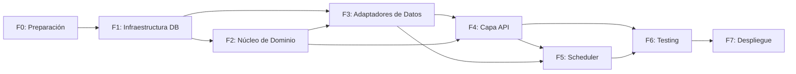
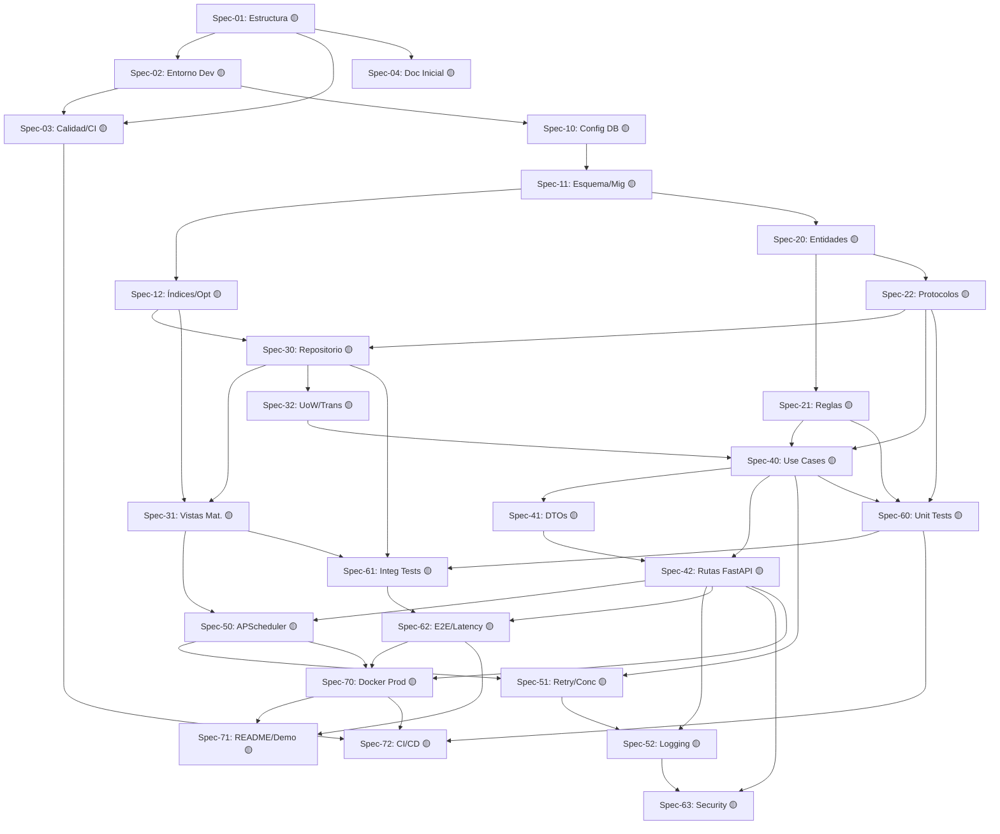

# WORKFLOW.md

**Nombre del Proyecto:** Inventario Histórico & Stock por Fecha  
**Versión:** 1.0.0  
**Fecha de Creación:** 2026-05-14 
**Estado Actual:** En Planificación  
**Responsable:** Fisherk2 (Desarrollador Principal / Arquitecto)

---
## **📌 Contexto del Proyecto**

**Objetivo:**  
Desarrollar una API REST backend que garantice un registro inmutable de movimientos de inventario y permita consultar el stock exacto en cualquier fecha histórica, cumpliendo un SLA de `<100ms` mediante el uso estratégico de PostgreSQL, Vistas Materializadas y SQL avanzado (CTEs, Window Functions). El sistema servirá como demostración técnica de Spec-Driven Development, Clean Architecture y optimización de consultas analíticas.

**Alcance:**

- ✅ **Incluido:** 
  - Registro atómico e inmutable de movimientos (entradas/salidas).
  - API REST versionada (`/v1/`) con validación estricta vía Pydantic.
  - Cálculo y mantenimiento de stock histórico mediante Vistas Materializadas (`REFRESH CONCURRENTLY`).
  - Scheduler interno (APScheduler) para actualización asíncrona.
  - Suite de pruebas con Testcontainers (PostgreSQL efímero).
  - Documentación OpenAPI auto-generada.
- ❌ **Excluido:** 
  - Autenticación/Autorización (OAuth, JWT, RBAC).
  - Interfaz gráfica de usuario (Frontend/Web).
  - Arquitectura de microservicios distribuidos.
  - Integración con pasarelas de pago o ERPs externos.

**Stakeholders:**

| Rol                      | Nombre              | Contacto       | Responsabilidades                                                                        |
| ------------------------ | ------------------- | -------------- | ---------------------------------------------------------------------------------------- |
| Arquitecto/Dev Principal | Fisherk2            | GitHub/Local   | Diseño, implementación, revisión de specs, mantenimiento de `AGENTS.MD` y `WORKFLOW.MD`  |
| QA / Tester Automatizado | CI/CD Pipeline      | GitHub Actions | Validación de contratos, ejecución de tests unitarios/integración, métricas de cobertura |
| Reviewer Técnico         | Portfolio Evaluator | GitHub PRs     | Validación de SLA, calidad arquitectónica, trazabilidad de specs                         |

---
## **🗺️ Roadmap de Implementación**

**Metodología:** *Spec-Driven Development* (adaptable a iteraciones ágiles).  
**Enfoque:** Implementación por *specs* con seguimiento estricto de dependencias y aprobaciones.

---
### **📅 Fases e Hitos**

| Fase                               | Duración Estimada | Estado       | Hitos Clave                                                                                                                                                |
| ---------------------------------- | ----------------- | ------------ | ---------------------------------------------------------------------------------------------------------------------------------------------------------- |
| **F0: Preparación**                | 2-3 días          | 🟡 Pendiente | ✅ Estructura de proyecto, `.gitignore`, `.env.example`, `pyproject.toml`, configuración de linters (`ruff`, `black`), setup de `pytest` + `testcontainers` |
| **F1: Infraestructura DB**         | 3-4 días          | 🔴 Bloqueado | ✅ Esquema normalizado (3NF), migraciones SQL versionadas, índices compuestos, script de seed para pruebas                                                  |
| **F2: Núcleo de Dominio**          | 4-5 días          | 🔴 Bloqueado | ✅ Entidades `Product`/`Movement`, reglas de negocio puras, protocolos de repositorio, casos de uso con inyección de dependencias                           |
| **F3: Adaptadores de Datos**       | 3-4 días          | 🔴 Bloqueado | ✅ Implementación `PostgresRepository` con `asyncpg`, queries SQL explícitas (CTEs, Window Functions), vistas materializadas + `REFRESH CONCURRENTLY`       |
| **F4: Capa de Aplicación/API**     | 4-5 días          | 🔴 Bloqueado | ✅ Rutas FastAPI `/v1/movements`, `/v1/stock`, validación Pydantic, manejo de errores, documentación OpenAPI auto-generada                                  |
| **F5: Scheduler & Concurrencia**   | 2-3 días          | 🔴 Bloqueado | ✅ Integración APScheduler, política de refresh, manejo de reintentos (optimistic concurrency), logging estructurado                                        |
| **F6: Testing Integral**           | 3-4 días          | 🔴 Bloqueado | ✅ Suite unitaria (mocked protocols), integración (Testcontainers), E2E (latencia `<100ms`), métricas de cobertura >85%                                     |
| **F7: Despliegue & Documentación** | 2-3 días          | 🔴 Bloqueado | ✅ `Dockerfile` multi-stage, `docker-compose.yml`, README técnico, `AGENTS.MD` final, demo script                                                           |

---
### **🔄 Dependencias Críticas entre Fases**

> [!NOTE]
> - Cada fase requiere **aprobación explícita** antes de avanzar.
> - Los specs dentro de cada fase siguen el orden definido en la tabla de `WORKFLOW.MD` (sección 📋 _Specs_).
> - Cualquier desviación de arquitectura debe ser documentada en `AGENTS.MD` con justificación técnica.

## 📋 *Specs* y Seguimiento
📁 **Directorio de referencia:** `specs/` (cada spec tendrá su archivo con contratos, ejemplos y SQL validado)

| ID      | Nombre                           | Descripción breve                                                                | Prioridad | Fase                | Archivos Involucrados                                                    | Dependencias              | Checklist | Estado   | Fechas                                                  | Aprobaciones                                                | Notas/Blockeos |
| ------- | -------------------------------- | -------------------------------------------------------------------------------- | --------- | ------------------- | ------------------------------------------------------------------------ | ------------------------- | --------- | -------- | ------------------------------------------------------- | ----------------------------------------------------------- | -------------- |
| Spec-01 | Estructura y convenciones        | Árbol de carpetas Clean Architecture, naming conventions, `.gitignore`           | Alta      | F0: Preparación     | `src/`, `tests/`, `.gitignore`, `pyproject.toml`                         | Ninguna                   | [0/4]     | 🟡 Pend. | Límite: 2026-05-18; Inicio: 2026-05-16; Fin: 2026-05-17 | Diseño: [🟡]; Código: [🟡]; Pruebas: [🟡]; Despliegue: [🟡] | -              |
| Spec-02 | Entorno de desarrollo            | Docker Compose dev, `.env.example`, `Makefile`, scripts de setup local           | Alta      | F0: Preparación     | `docker-compose.dev.yml`, `.env.example`, `Makefile`, `requirements.txt` | Spec-01                   | [0/3]     | 🟡 Pend. | Límite: 2026-05-18; Inicio: 2026-05-17; Fin: 2026-05-18 | Diseño: [🟡]; Código: [🟡]; Pruebas: [🟡]; Despliegue: [🟡] | -              |
| Spec-03 | Calidad y automatización         | `ruff`, `black`, `pytest` config, pre-commit hooks, CI/CD base                   | Media     | F0: Preparación     | `.pre-commit-config.yaml`, `pyproject.toml`, `.github/workflows/`        | Spec-01, Spec-02          | [0/5]     | 🟡 Pend. | Límite: 2026-05-18; Inicio: 2026-05-17; Fin: 2026-05-18 | Diseño: [🟡]; Código: [🟡]; Pruebas: [🟡]; Despliegue: [🟡] | -              |
| Spec-04 | Documentación inicial            | `AGENTS.MD`, `WORKFLOW.MD`, `CONTRIBUTING.MD`, estructura de `specs/`            | Alta      | F0: Preparación     | `AGENTS.MD`, `WORKFLOW.MD`, `README.md`, `specs/`                        | Spec-01                   | [0/4]     | 🟡 Pend. | Límite: 2026-05-18; Inicio: 2026-05-16; Fin: 2026-05-18 | Diseño: [🟡]; Código: [🟡]; Pruebas: [🟡]; Despliegue: [🟡] | -              |
| Spec-10 | Configuración DB                 | PostgreSQL 16+, `asyncpg` setup, connection pooling, healthcheck                 | Alta      | F1: Infraestructura | `src/infrastructure/db/`, `docker-compose.dev.yml`                       | Spec-02                   | [0/3]     | 🔴 Bloq. | Límite: 2026-05-22; Inicio: 2026-05-19; Fin: 2026-05-20 | Diseño: [🟡]; Código: [🟡]; Pruebas: [🟡]; Despliegue: [🟡] | -              |
| Spec-11 | Esquema y Migraciones            | Tablas `products`, `movements`, constraints, FK, 3NF, `alembic` o SQL raw        | Alta      | F1: Infraestructura | `migrations/`, `specs/` (DDL)                                            | Spec-10                   | [0/6]     | 🔴 Bloq. | Límite: 2026-05-22; Inicio: 2026-05-20; Fin: 2026-05-22 | Diseño: [🟡]; Código: [🟡]; Pruebas: [🟡]; Despliegue: [🟡] | -              |
| Spec-12 | Índices y Optimización Base      | Índices compuestos, parciales, `EXPLAIN` baseline, seed data                     | Media     | F1: Infraestructura | `migrations/`, `specs/` (indexes.sql)                                    | Spec-11                   | [0/4]     | 🔴 Bloq. | Límite: 2026-05-22; Inicio: 2026-05-21; Fin: 2026-05-22 | Diseño: [🟡]; Código: [🟡]; Pruebas: [🟡]; Despliegue: [🟡] | -              |
| Spec-20 | Entidades (Domain)               | Clases `Product`, `Movement`, value objects, excepciones de dominio              | Alta      | F2: Núcleo          | `src/domain/entities/`, `src/domain/exceptions/`                         | Spec-11                   | [0/5]     | 🔴 Bloq. | Límite: 2026-05-27; Inicio: 2026-05-23; Fin: 2026-05-25 | Diseño: [🟡]; Código: [🟡]; Pruebas: [🟡]; Despliegue: [🟡] | -              |
| Spec-21 | Reglas de Negocio                | Validación inmutabilidad, stock no negativo, transaccionalidad lógica            | Alta      | F2: Núcleo          | `src/domain/rules/`, `src/domain/protocols/`                             | Spec-20                   | [0/4]     | 🔴 Bloq. | Límite: 2026-05-27; Inicio: 2026-05-24; Fin: 2026-05-27 | Diseño: [🟡]; Código: [🟡]; Pruebas: [🟡]; Despliegue: [🟡] | -              |
| Spec-22 | Protocolos/Interfaces            | `IMovementRepository`, `IStockQueryRepo`, `IUseCase` (ABC/Protocol)              | Alta      | F2: Núcleo          | `src/domain/ports/`, `specs/` (interfaces.md)                            | Spec-20                   | [0/3]     | 🔴 Bloq. | Límite: 2026-05-27; Inicio: 2026-05-25; Fin: 2026-05-27 | Diseño: [🟡]; Código: [🟡]; Pruebas: [🟡]; Despliegue: [🟡] | -              |
| Spec-30 | Implementación Repositorio       | `asyncpg` wrapper, SQL explícito, mapeo DTO<->Row, connection management         | Alta      | F3: Adaptadores     | `src/infrastructure/repositories/`                                       | Spec-12, Spec-22          | [0/6]     | 🔴 Bloq. | Límite: 2026-05-31; Inicio: 2026-05-28; Fin: 2026-05-30 | Diseño: [🟡]; Código: [🟡]; Pruebas: [🟡]; Despliegue: [🟡] | -              |
| Spec-31 | Vistas Materializadas & Refresh  | `mv_stock_historical`, `REFRESH CONCURRENTLY`, trigger de cálculo, fallback      | Alta      | F3: Adaptadores     | `migrations/`, `specs/` (materialized.sql)                               | Spec-12, Spec-30          | [0/5]     | 🔴 Bloq. | Límite: 2026-05-31; Inicio: 2026-05-29; Fin: 2026-05-31 | Diseño: [🟡]; Código: [🟡]; Pruebas: [🟡]; Despliegue: [🟡] | -              |
| Spec-32 | Unit of Work & Transacciones     | Context manager `asyncpg.transaction()`, commit/rollback explícito               | Media     | F3: Adaptadores     | `src/infrastructure/db/uow.py`                                           | Spec-30                   | [0/3]     | 🔴 Bloq. | Límite: 2026-05-31; Inicio: 2026-05-30; Fin: 2026-05-31 | Diseño: [🟡]; Código: [🟡]; Pruebas: [🟡]; Despliegue: [🟡] | -              |
| Spec-40 | Casos de Uso (Application)       | `CreateMovementUseCase`, `QueryStockAtDateUseCase`, orquestación de reglas       | Alta      | F4: API             | `src/application/use_cases/`                                             | Spec-21, Spec-22, Spec-32 | [0/5]     | 🔴 Bloq. | Límite: 2026-06-05; Inicio: 2026-06-01; Fin: 2026-06-04 | Diseño: [🟡]; Código: [🟡]; Pruebas: [🟡]; Despliegue: [🟡] | -              |
| Spec-41 | DTOs & Validación Pydantic       | Input/Output models, validación estricta, serialización JSON                     | Alta      | F4: API             | `src/application/dtos/`                                                  | Spec-40                   | [0/4]     | 🔴 Bloq. | Límite: 2026-06-05; Inicio: 2026-06-02; Fin: 2026-06-03 | Diseño: [🟡]; Código: [🟡]; Pruebas: [🟡]; Despliegue: [🟡] | -              |
| Spec-42 | Rutas FastAPI /v1/ & OpenAPI     | Endpoints REST, dependency injection, error mapping, auto-doc                    | Alta      | F4: API             | `src/adapters/api/routers/`, `src/main.py`                               | Spec-40, Spec-41          | [0/5]     | 🔴 Bloq. | Límite: 2026-06-05; Inicio: 2026-06-03; Fin: 2026-06-05 | Diseño: [🟡]; Código: [🟡]; Pruebas: [🟡]; Despliegue: [🟡] | -              |
| Spec-50 | Integración APScheduler          | Cron job interno, política de refresh, isolation de resources                    | Media     | F5: Scheduler       | `src/infrastructure/scheduler/`, `specs/` (scheduler.md)                 | Spec-31, Spec-42          | [0/4]     | 🔴 Bloq. | Límite: 2026-06-08; Inicio: 2026-06-06; Fin: 2026-06-07 | Diseño: [🟡]; Código: [🟡]; Pruebas: [🟡]; Despliegue: [🟡] | -              |
| Spec-51 | Optimistic Concurrency & Retry   | Decorador `@retry`, backoff exponencial, manejo `HTTP 409`                       | Alta      | F5: Scheduler       | `src/application/middleware/`, `src/domain/exceptions/`                  | Spec-40, Spec-50          | [0/3]     | 🔴 Bloq. | Límite: 2026-06-08; Inicio: 2026-06-07; Fin: 2026-06-08 | Diseño: [🟡]; Código: [🟡]; Pruebas: [🟡]; Despliegue: [🟡] | -              |
| Spec-52 | Logging Estructurado & Errors    | `structlog`/`logging` JSON, timeouts, circuit breakers, fallbacks                | Media     | F5: Scheduler       | `src/core/logging.py`, `src/core/config.py`                              | Spec-42, Spec-51          | [0/4]     | 🔴 Bloq. | Límite: 2026-06-08; Inicio: 2026-06-07; Fin: 2026-06-08 | Diseño: [🟡]; Código: [🟡]; Pruebas: [🟡]; Despliegue: [🟡] | -              |
| Spec-60 | Tests Unitarios                  | Cobertura dominio/app, mocks de protocolos, `pytest`                             | Alta      | F6: Testing         | `tests/unit/`, `tests/fixtures/`                                         | Spec-21, Spec-22, Spec-40 | [0/5]     | 🔴 Bloq. | Límite: 2026-06-12; Inicio: 2026-06-09; Fin: 2026-06-11 | Diseño: [🟡]; Código: [🟡]; Pruebas: [🟡]; Despliegue: [🟡] | -              |
| Spec-61 | Tests Integración                | `testcontainers.postgres`, seed DB, validación SQL real, `asyncpg`               | Alta      | F6: Testing         | `tests/integration/`                                                     | Spec-30, Spec-31, Spec-60 | [0/6]     | 🔴 Bloq. | Límite: 2026-06-12; Inicio: 2026-06-10; Fin: 2026-06-12 | Diseño: [🟡]; Código: [🟡]; Pruebas: [🟡]; Despliegue: [🟡] | -              |
| Spec-62 | Tests E2E & Latencia <100ms      | `httpx` client, validación contratos OpenAPI, métricas de tiempo, load test base | Alta      | F6: Testing         | `tests/e2e/`, `specs/` (performance.md)                                  | Spec-42, Spec-61          | [0/5]     | 🔴 Bloq. | Límite: 2026-06-12; Inicio: 2026-06-11; Fin: 2026-06-12 | Diseño: [🟡]; Código: [🟡]; Pruebas: [🟡]; Despliegue: [🟡] | -              |
| Spec-63 | Pruebas de Seguridad & OWASP     | Inyección SQL, validación inputs, rate limit básico, sanitización                | Media     | F6: Testing         | `tests/security/`, `specs/` (security.md)                                | Spec-42, Spec-52          | [0/4]     | 🔴 Bloq. | Límite: 2026-06-12; Inicio: 2026-06-12; Fin: 2026-06-12 | Diseño: [🟡]; Código: [🟡]; Pruebas: [🟡]; Despliegue: [🟡] | -              |
| Spec-70 | Dockerfile & Docker Compose Prod | Multi-stage build, optimización imagen, `docker-compose.prod.yml`, healthchecks  | Alta      | F7: Despliegue      | `Dockerfile`, `docker-compose.prod.yml`                                  | Spec-42, Spec-50, Spec-62 | [0/5]     | 🔴 Bloq. | Límite: 2026-06-15; Inicio: 2026-06-13; Fin: 2026-06-14 | Diseño: [🟡]; Código: [🟡]; Pruebas: [🟡]; Despliegue: [🟡] | -              |
| Spec-71 | README Técnico & Demo Script     | Instrucciones setup, arquitectura, diagramas, script demo interactivo            | Media     | F7: Despliegue      | `README.md`, `scripts/demo.sh`, `docs/`                                  | Spec-62, Spec-70          | [0/4]     | 🔴 Bloq. | Límite: 2026-06-15; Inicio: 2026-06-14; Fin: 2026-06-15 | Diseño: [🟡]; Código: [🟡]; Pruebas: [🟡]; Despliegue: [🟡] | -              |
| Spec-72 | CI/CD Pipeline                   | GitHub Actions: lint, test, coverage, build, push, deploy staging                | Alta      | F7: Despliegue      | `.github/workflows/ci.yml`                                               | Spec-03, Spec-60, Spec-70 | [0/5]     | 🔴 Bloq. | Límite: 2026-06-15; Inicio: 2026-06-13; Fin: 2026-06-15 | Diseño: [🟡]; Código: [🟡]; Pruebas: [🟡]; Despliegue: [🟡] | -              |

> [!warning]
> 1. **Ningún spec inicia** hasta que sus `Dependencias → Requeridas` estén en estado ✅ **Completado**.
> 2. **Cada spec** debe tener su archivo `specs/SPEC-XX.md` con contratos, payloads de ejemplo, y SQL/queries validados antes de escribir código.
> 3. **Checklist se actualiza** en tiempo real: `[X/Y]` → `🟢/🟡/🔴/✅`.
> 4. **Bloqueos** se documentan en la columna `Notas/Blockeos`. Si un spec lleva >2 días en 🟡, se escala a revisión arquitectónica.

## 🔗 Diagrama de dependencia entre *Specs*

> [!NOTE] Dependencias implícitas por fase
> - El grafo es un **DAG (Directed Acyclic Graph)**. No contiene ciclos.
> - Cada flecha indica `Prerrequisito → Dependiente`. Un spec solo puede iniciar cuando todos sus nodos entrantes estén en ✅.
> - La estructura refleja principios de *Clean Architecture* (dependencia hacia el dominio) y *Clean Code* (granularidad SRP por spec).
> - Los libros de referencia cargados (Dooley, Dennis/Wixom/Roth, Martin) respaldan la segregación de contratos, la dirección de dependencias y la validación incremental que este grafo impone.

---
## 📜 Reglas de flujo de trabajo
1. **Especificación antes que Código:** Ningún archivo de implementación (`*.py`, `*.sql`) se creará sin un `specs/SPEC-XX.md` validado que defina contratos, payloads, y criterios de aceptación.
2. **Orden Estricto del DAG:** Un spec solo pasa a estado `🟢 En Progreso` cuando **todas** sus dependencias en `Requeridas` estén `✅ Completado`. Saltar dependencias rompe la trazabilidad y se rechaza automáticamente.
3. **Dirección de Dependencias (Clean Architecture):** El código siempre apunta hacia el dominio. `infrastructure` → `application` → `domain`. Nunca al revés. Se aplica el *Dependency Inversion Principle* (Martin, 2017) mediante `typing.Protocol` y mocks en testing.
4. **Inmutabilidad y Append-Only:** La tabla `movements` es sagrada. `UPDATE`/`DELETE` directos están prohibidos. Correcciones se manejan mediante movimientos compensatorios (`type: ADJUSTMENT`).
5. **SQL Explícito y Optimización:** Las consultas analíticas usan CTEs/Window Functions nativas. Está prohibido usar ORM para queries de stock histórico. Cada query compleja debe incluir su `EXPLAIN ANALYZE` en el spec correspondiente.
6. **Testing con Testcontainers:** Las pruebas de integración **no** mockean PostgreSQL. Se usa `testcontainers.postgres` para garantizar que el comportamiento de índices, vistas materializadas y transacciones sea 1:1 con producción.
7. **Commits y Versionado:** Mensajes de commit siguen Conventional Commits (`feat:`, `fix:`, `refactor:`, `docs:`). Cada merge a `main` debe cerrar un spec completo con su checklist `✅`.
8. **Revisión de Deuda Técnica:** Si un spec lleva >48h en `🟡` o `🔴`, se detiene la implementación de specs dependientes y se escala a análisis de riesgo antes de continuar.

---
## 📌 Anexos
| Documento | Ruta | Propósito |
|-----------|------|-----------|
| `AGENTS.MD` | `/AGENTS.MD` | Fuente de verdad arquitectónica, patrones, guías SOLID/DRY, y prohibiciones técnicas |
| `README.md` | `/README.md` | Onboarding, setup local, estructura del proyecto, y demo commands |
| `specs/` | `/specs/` | Directorio con `SPEC-XX.md` individuales (contratos, SQL, fixtures, validaciones) |
| `docs/openapi.json` | `/docs/openapi.json` | Contrato REST generado automáticamente desde FastAPI/Pydantic |
| `CONTRIBUTING.md` | `/CONTRIBUTING.md` | Guía de estilo, pre-commit hooks, y flujo de PRs |

---
## 💡 Notas para la IA Agéntica
1. **Contexto Prioritario:** Al generar código o specs, inyecta siempre las restricciones de `AGENTS.MD` (SRP, DIP, Inmutabilidad, SQL explícito, Testcontainers). Si una solicitud del usuario contradice estos principios, **rechaza explícitamente** y propone la alternativa alineada a Clean Architecture.
2. **Validación de Specs:** Antes de escribir implementación, verifica que el spec referenciado exista, tenga contratos definidos (Input/Output), y que sus dependencias estén `✅`. Si falta información, solicita aclaración antes de proceder.
3. **Manejo de Estado:** Mantén un registro mental del estado actual de cada spec. Al generar código, actualiza implícitamente el checklist del spec y notifica al usuario para confirmación manual en `WORKFLOW.MD`.
4. **Referencias Técnicas:** Aplica conceptos de *Clean Architecture* (Robert C. Martin), *Spec-Driven Development*, y *Engineering Practices* (Dooley, Dennis/Wixom) para justificar decisiones. Utiliza principios (SOLID, DRY, Ortogonalidad, Humble Object) cuando expliques el *porqué* de una elección técnica.
5. **Fallback Seguro:** Si una query supera `<100ms` en pruebas E2E, no optimices ciegamente. Primero valida el `EXPLAIN`, luego ajusta índices parciales o acota rangos de fecha. Documenta el cambio en el spec correspondiente.
6. **Tono y Formato:** Mantén un tono técnico, pedagógico y directo. Usa Mermaid para diagramas, tablas para contratos, y bloques de código con sintaxis destacada. Evita ambigüedades; cada respuesta debe ser accionable o solicitadora de validación.