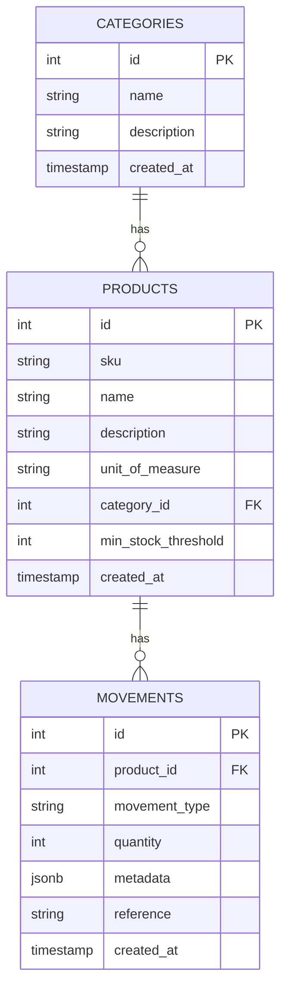
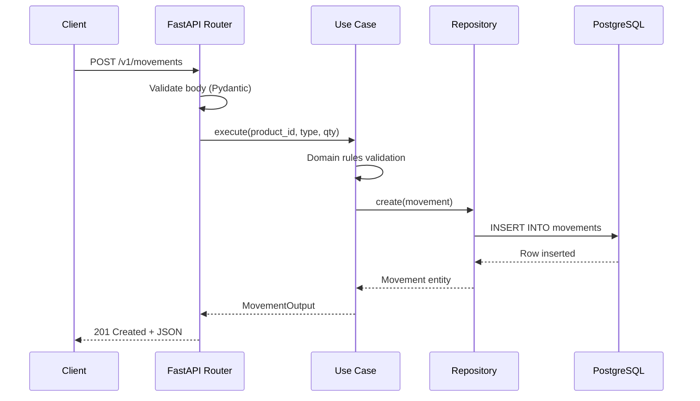

# Arquitectura del Sistema — Stock Historial

## Overview

Stock Historial es un sistema de gestión de inventario basado en el patrón **Source of Truth Inmutable**. Cada movimiento de stock es un registro atómico e inalterable. Las consultas de stock (actual e histórico) se resuelven mediante vistas materializadas en PostgreSQL con tiempos de respuesta `<100ms`.

**Principios arquitectónicos:**

- **Inmutabilidad como fuente de verdad:** Los movimientos nunca se modifican ni eliminan. El stock se calcula a partir de la suma de movimientos.
- **Clean Architecture:** Separación estricta entre dominio, aplicación, infraestructura y adaptadores.
- **Dependency Inversion:** Las dependencias apuntan siempre hacia el centro (dominio).
- **KISS + YAGNI:** SQL explícito sobre ORM. Abstracciones solo cuando el caso de uso lo exige.

## Diagrama de Capas

```mermaid
graph TB
    subgraph "Adapters (outer)"
        A1[FastAPI Routers]
        A2[Middleware: Error Mapping]
        A3[Middleware: Request Logging]
    end

    subgraph "Application (use cases)"
        B1[CreateMovementUseCase]
        B2[QueryStockAtDateUseCase]
        B3[CreateProductUseCase]
        B4[CreateCategoryUseCase]
        B5[DTOs Pydantic]
    end

    subgraph "Domain (core)"
        C1[Entities: Product, Movement, Category]
        C2[Value Objects: SKU, Quantity, MovementType]
        C3[Rules: Stock Validation, Immutability]
        C4[Ports: Repository Interfaces]
        C5[Exceptions]
    end

subgraph "Infrastructure (outer)"
D1[PostgresRepository impls ← BasePostgresRepository]
D2[asyncpg Connection Pool (configurable)]
D3[APScheduler]
D4[Structured Logging]
D5[Materialized Views]
end

    A1 --> B1
    A1 --> B2
    A1 --> B3
    A2 --> A1
    A3 --> A1

    B1 --> C4
    B2 --> C4
    B3 --> C4
    B4 --> C4
    B5 --> C1

    C4 -. implements .-> D1
    D1 --> D2
    D2 --> D5
    D3 --> B2
    D4 --> A1
    D4 --> B1

    classDef domain fill:#e8f5e9,stroke:#2e7d32,stroke-width:2px
    classDef app fill:#e3f2fd,stroke:#1565c0,stroke-width:2px
    classDef infra fill:#fff3e0,stroke:#e65100,stroke-width:2px
    classDef adapt fill:#f3e5f5,stroke:#6a1b9a,stroke-width:2px

    class C1,C2,C3,C4,C5 domain
    class B1,B2,B3,B4,B5 app
    class D1,D2,D3,D4,D5 infra
    class A1,A2,A3 adapt
```

## Capas Detalladas

### Domain (Core)

**Responsabilidades:** Entidades de negocio, value objects, reglas de validación, protocolos de interfaz.

**Componentes:**
- `entities/` — `Product`, `Movement`, `Category` — todas `frozen=True` (`@dataclass(frozen=True)`), inmutables post-construcción
- `value_objects/` — `SKU` (pattern validated), `Quantity` (positive), `MovementType` (`StrEnum`, no `str, Enum`)
- `rules/` — Stock no negativo, inmutabilidad de movimientos, validación de metadata condicional (single source of truth en `Movement.__post_init__`)
- `ports/` — `IMovementRepository`, `IProductRepository`, `ICategoryRepository`, `IStockQueryRepository`
- `exceptions/` — `DomainError` (base), `InsufficientStockError`, `ImmutabilityViolationError`, `ProductNotFoundError`, `CategoryNotFoundError`, `ConcurrencyConflictError`, `InvalidSKUError`, `InvalidQuantityError`

**Regla de importación:** No importa de ninguna otra capa.

### Application (Use Cases)

**Responsabilidades:** Orquestación de casos de uso, DTOs de entrada/salida, validación Pydantic.

**Componentes:**
- `use_cases/` — `CreateMovementUseCase`, `QueryCurrentStockUseCase`, `QueryStockAtDateUseCase`, `CreateProductUseCase`, `CreateCategoryUseCase`, `ListProductsUseCase`
- `dtos/` — `CreateMovementInput`, `MovementOutput`, `CurrentStockOutput`, `StockAtDateOutput`, `CreateProductInput`, `ProductOutput`, etc.

**Regla de importación:** Importa solo del dominio. Usa protocolos (`ports/`) para abstracción de datos.

### Infrastructure (Data & Services)

**Responsabilidades:** Implementación de repositorios, conexiones DB, scheduler, logging, vistas materializadas.

**Componentes:**
- `db/` — Connection pool asyncpg (tamaño configurable via `db_pool_min_size`/`db_pool_max_size`), Unit of Work (rollback seguro ante excepciones), migraciones (soporte `-- non-transactional`), seed
- `repositories/` — `BasePostgresRepository` (abstract), `MovementRepository`, `ProductRepository`, `CategoryRepository`, `StockQueryRepository` (todos heredan de `BasePostgresRepository`)
- `repositories/mappers.py` — Funciones puras `asyncpg.Record → Entity`, tipado explícito, manejo `JSONDecodeError` con fallback
- `scheduler/` — APScheduler con política de refresh, retry con backoff exponencial
- `logging/` — Logging estructurado JSON con request_id

**Regla de importación:** Importa del dominio y aplicación. Implementa los protocolos definidos en `ports/`.

### Adapters (API & HTTP)

**Responsabilidades:** Routers FastAPI, middleware, inyección de dependencias.

**Componentes:**
- `routers/` — `health.py`, `categories.py`, `products.py`, `movements.py`, `stock.py`
- `middleware/` — Error mapping (domain exceptions → HTTP status codes: `ProductNotFoundError`→400, `CategoryNotFoundError`→400, `InsufficientStockError`→409, etc.), request logging
- `dependencies.py` — Factory functions para DI

**Regla de importación:** Importa de aplicación e infraestructura. `dependencies.py` importa protocolos de `domain/ports/` como único puente; los routers no importan del dominio directamente.

## Reglas de Importación

| Capa | Puede importar | No puede importar |
|---|---|---|
| **Domain** | Nada de otras capas | Application, Infrastructure, Adapters |
| **Application** | Domain | Infrastructure, Adapters |
| **Infrastructure** | Domain, Application | Adapters |
| **Adapters** | Application, Infrastructure, `domain/ports/` (solo protocolos via DI) | `domain/entities/`, `domain/rules/` (directo) |

## Patrones Clave

### Repository Pattern

Cada agregado tiene su repositorio definido como protocolo en el dominio e implementado en infraestructura. Todos los repositorios concretos heredan de `BasePostgresRepository` (clase abstracta con `__init__` y `_get_conn()` compartidos):

```
Domain: IMovementRepository (protocol)
↓
Infrastructure: BasePostgresRepository (abstract — pool + connection)
↓
Infrastructure: MovementRepository (concrete, inherits BasePostgresRepository)
↓
Application: Use cases dependen del protocolo, no la implementación
```

### Unit of Work

Patrón de transacción con context manager. Garantiza atomicidad de operaciones:

```python
async with uow:
    await movement_repo.create(movement)
    await product_repo.update(product)
    # Commit implícito al salir del context
    # Rollback automático en caso de excepción
```

**Comportamiento en rollback fallido:** Si el rollback falla mientras ya existe una excepción activa, se loggea el error del rollback pero se preserva la excepción original (no se suprime).

### CQRS vía Materialized Views

- **Write:** Movimientos se registran como eventos atómicos en la tabla `movements`.
- **Read:** Consultas de stock usan `mv_stock_historical` (vista materializada) para `<100ms`.
- **Refresh:** APScheduler ejecuta `REFRESH CONCURRENTLY` periódicamente. Fallback a cálculo directo si la vista no está disponible.

### Source of Truth Inmutable

| Operación | Comportamiento |
|---|---|
| Crear movimiento | INSERT atómico — nunca se modifica |
| Corregir error | Nuevo movimiento compensatorio (no UPDATE) |
| Eliminar movimiento | No permitido (inmutabilidad) |
| Consultar stock | SUM() sobre movimientos o vista materializada |

## Decisiones Técnicas

| Decisión | Racional |
|---|---|
| **SQL explícito (sin ORM)** | Control total sobre queries. Sin overhead de abstracción. Performance predecible |
| **asyncpg** | Driver asíncrono nativo para PostgreSQL. Mayor rendimiento que psycopg en carga concurrente. Maneja `dict → JSONB` nativamente (no requiere `json.dumps()`) |
| **StrEnum (no `str, Enum`)** | `MovementType` usa `StrEnum` para serialización directa a string sin mixin boilerplate |
| **APScheduler** | Scheduler interno (no requiere infraestructura adicional). Cron job para refresh de MV |
| **Pydantic strict mode** | Validación estricta de tipos. Prevención de coerciones silenciosas |
| **Hypothesis PBT** | Property-based testing para cubrir edge cases que los tests manuales pasan por alto |
| **testcontainers** | PostgreSQL real en containers para tests de integración. Sin mocks de DB |
| **BasePostgresRepository** | Clase abstracta que DRY up `__init__` y `_get_conn()` — 4 repos comparten la misma lógica de conexión |
| **SQL parametrizado (`$1`)** | `SET statement_timeout = $1` en vez de f-string. Previene SQL injection y sigue convención asyncpg |
| **`-- non-transactional` migrations** | Soporte para `CREATE INDEX CONCURRENTLY` y otras operaciones que no pueden ejecutarse dentro de una transacción |

## Diagrama de Datos (ER)



## Diagrama de Flujo de Request


