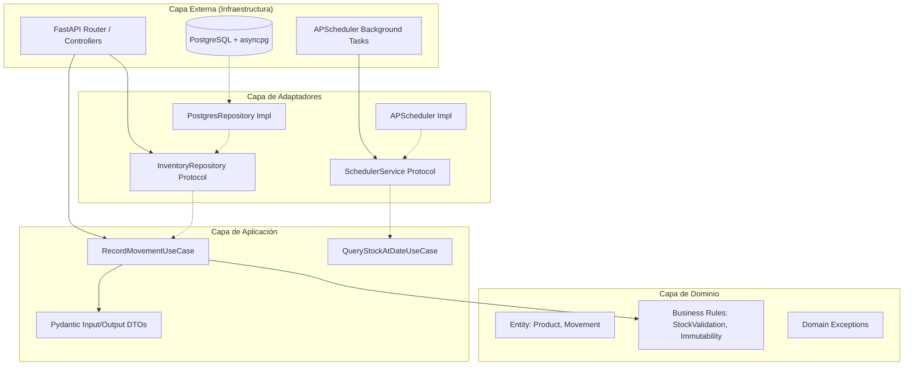

# Arquitectura y Diseño

## Patrón Arquitectónico: Clean Architecture + Ports & Adapters

El sistema sigue estrictamente el **Dependency Inversion Principle (DIP)**. Las dependencias de código fuente apuntan siempre hacia el centro (Dominio/Aplicación). PostgreSQL, FastAPI y APScheduler son detalles externos intercambiables.

## Estrategia de Comunicación y Estado

- **Comandos (Write):** Se envían a `RecordMovementUseCase`. Validan reglas de negocio (stock no negativo, tipo de movimiento válido) y delegan al repositorio.
- **Consultas (Read):** `QueryStockAtDateUseCase` lee de la vista materializada `mv_stock_historical`. Si la vista no está lista, fallback a cálculo directo con límite de paginación.
- **Manejo de Concurrencia:** Optimistic Concurrency con reintentos exponenciales. Versión transaccional o `READ COMMITTED` + retry en `asyncpg`.

## Justificación Técnica

- **SQL Explícito:** Control total sobre `EXPLAIN ANALYZE`, índices compuestos y CTEs. Sin ORM que oculte planes de ejecución.
- **FastAPI + Pydantic:** OpenAPI 3.0 nativo. Validación estricta sin boilerplate.
- **APScheduler Interno:** Refresh como tarea asíncrona aislada del ciclo request/response. Swappable a Celery/RQ sin tocar dominio.
