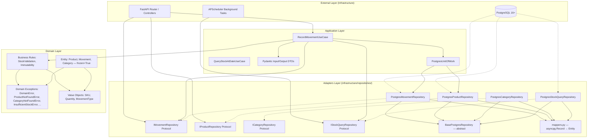

# Architecture and Design

## Architectural Pattern: Clean Architecture + Ports & Adapters

The system strictly follows the **Dependency Inversion Principle (DIP)**. Source code dependencies always point toward the center (Domain/Application). PostgreSQL, FastAPI, and APScheduler are interchangeable external details.

## Communication and State Strategy

- **Commands (Write):** Sent to `RecordMovementUseCase`. They validate business rules (non-negative stock, valid movement type) and delegate to the repository.
- **Queries (Read):** `QueryStockAtDateUseCase` reads from the materialized view `mv_stock_historical`. If the view is not ready, fallback to direct calculation with pagination limit.
- **Concurrency Handling:** Optimistic Concurrency with exponential retries. Transactional version or `READ COMMITTED` + retry in `asyncpg`.

## Technical Justification

- **Explicit SQL:** Full control over `EXPLAIN ANALYZE`, composite indexes, and CTEs. No ORM hiding execution plans.
- **FastAPI + Pydantic:** Native OpenAPI 3.0. Strict validation without boilerplate.
- **Internal APScheduler:** Refresh as an async task isolated from the request/response cycle. Swappable to Celery/RQ without touching the domain.

## Import Rules (Clean Architecture Enforcement)

The following import rules are mandatory and verified in CI:

| Layer | Can import from | Cannot import from |
|------|-------------------|---------------------|
| `domain/` | Only internal `domain/` modules | `application/`, `infrastructure/`, `adapters/` |
| `application/` | `domain/`, internal `application/` modules | `infrastructure/`, `adapters/` |
| `infrastructure/` | `domain/`, `application/`, external libs | `adapters/` |
| `adapters/` | `application/`, `infrastructure/`, `domain/ports/` (protocols only via DI), external libs | `domain/entities/`, `domain/rules/` (direct) |

**Automated verification:**
- `ruff` with `ban-relative-imports = "all"` prevents relative imports between packages
- CI runs `make lint` on every push/PR
- For strict per-directory enforcement, consider `import-linter` in future phases

**Convention:** If a `domain/` module needs infrastructure access, define a `Protocol` in `domain/ports/` and leave the concrete implementation in `infrastructure/repositories/`.

**DTO/VO Separation:** Application layer DTOs (`CreateMovementInput`, etc.) use their own enums (`MovementTypeInput`) to maintain Clean Architecture independence. The `MovementTypeInput → MovementType` (domain VO) mapping is done in the router adapter, not in the DTO. This prevents the application layer from directly depending on domain value objects, maintaining the principle that DTOs are the public API contract.

### Mappers (asyncpg.Record → Entity)

Mappers are **pure functions** located in `src/infrastructure/repositories/mappers.py`. They transform `asyncpg.Record` (explicitly typed) into domain entities (`@dataclass(frozen=True)`). They are stateless, do not access the DB, and are deterministic:

- `map_category_row(record: asyncpg.Record) -> Category`
- `map_product_row(record: asyncpg.Record) -> Product` — builds `SKU` VO from string
- `map_movement_row(record: asyncpg.Record) -> Movement` — parses `movement_type` string → `StrEnum`, `quantity` int → `Quantity` VO, `metadata` JSONB → `dict[str, Any]` with `JSONDecodeError` handling (fallback to `{}`)

This separation keeps repositories focused on I/O and delegates transformation to functions that can be tested in isolation.

### BasePostgresRepository (DRY)

Abstract class in `src/infrastructure/repositories/base_repository.py` that centralizes shared connection management:

- `__init__(pool, connection=None)` — accepts pool and optional connection (for UoW)
- `_get_conn()` — returns the active connection if it exists (transaction), otherwise the pool

All 4 concrete repositories inherit from this class, eliminating duplication of `__init__` and `_get_conn()`.
