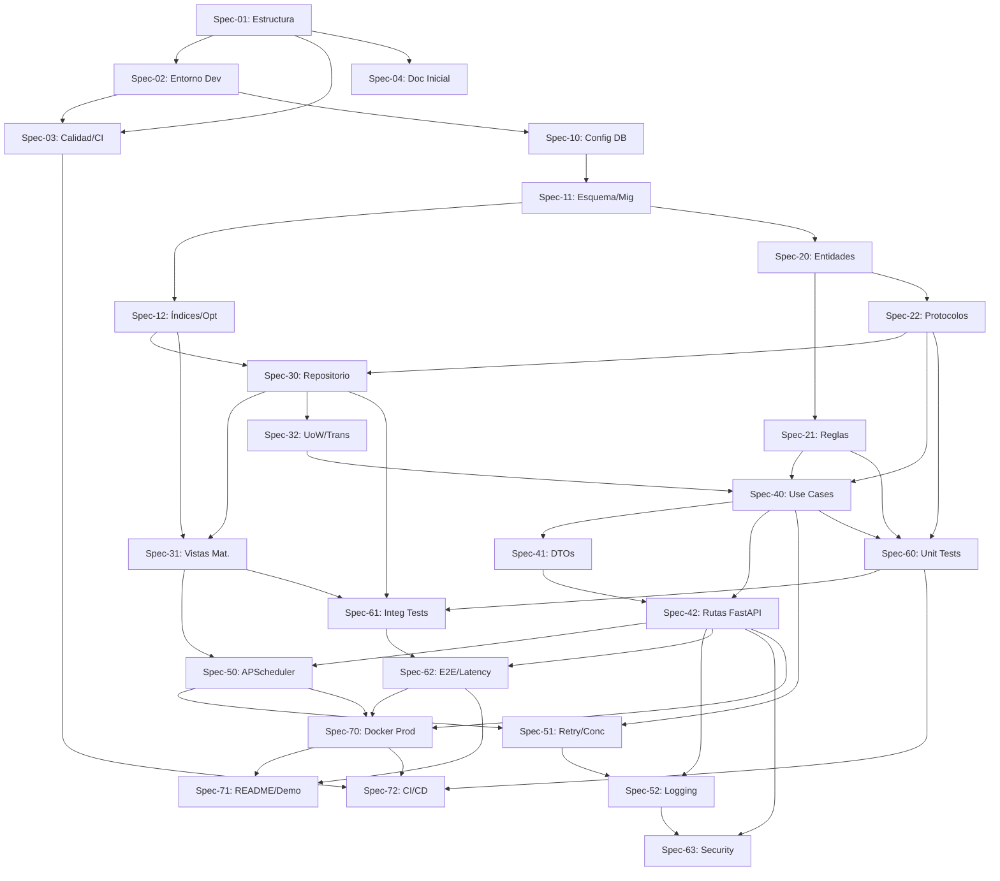

# Grafos de Dependencia entre Specs

> **Notas:**
> - El grafo es un **DAG** sin ciclos.
> - Cada flecha indica `Prerrequisito -> Dependiente`. Un spec solo puede iniciar cuando todos sus nodos entrantes estén completados.
> - La estructura sigue Clean Architecture: dependencia hacia el dominio.
> - Al añadir/modificar specs, actualizar este diagrama y verificar que no se introduzcan ciclos.
