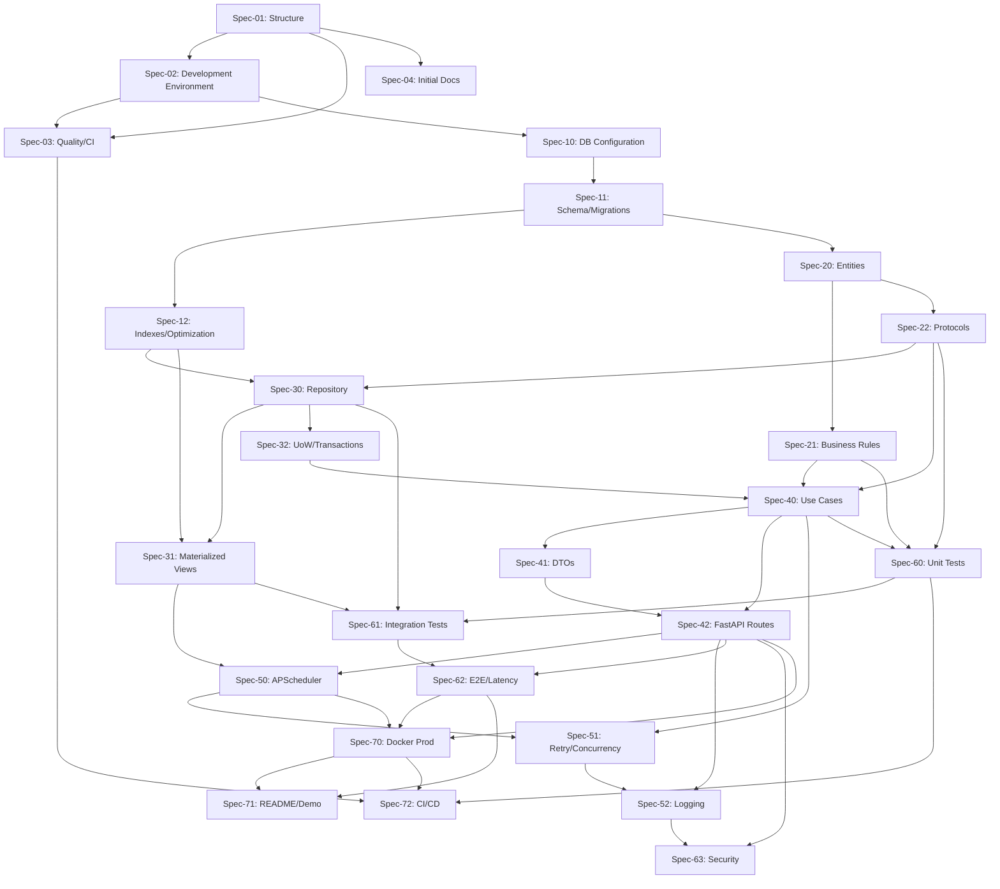

# Dependency Graphs between Specs

> **Notes:**
> - The graph is a **DAG** without cycles.
> - Each arrow indicates `Prerequisite -> Dependent`. A spec can only start when all its incoming nodes are completed.
> - The structure follows Clean Architecture: dependency flows towards the domain.
> - When adding/modifying specs, update this diagram and verify that no cycles are introduced.
