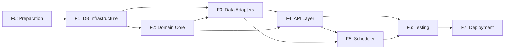

# Roadmap and Phases

**Methodology:** Spec-Driven Development (adaptable to agile iterations).

## Phases and Milestones

| Phase | Estimated Duration | Status     | Key Milestones |
|------|-------------------|------------|-------------|
| **F0: Preparation** | 2-3 days | Completed | Project structure, `.gitignore`, `.env.example`, `pyproject.toml`, linters, pytest + testcontainers |
| **F1: DB Infrastructure** | 3-4 days | Completed | Normalized schema (3NF), SQL migrations, composite indexes, seed data, immutability trigger |
| **F2: Domain Core** | 4-5 days | Completed | `Product`/`Movement` entities, business rules, protocols, unit tests (89 tests, 99.56% coverage) |
| **F3: Data Adapters** | 3-4 days | Completed | 4 `asyncpg` repositories, 3 mappers, `mv_stock_historical` with concurrent refresh, Unit of Work. 141 tests (100% pass), 96.30% coverage |
| **F4: Application/API Layer** | 4-5 days | Completed | Use cases, Pydantic validation (`extra="forbid"`, `StrEnum`), FastAPI routes `/v1/movements`, `/v1/stock`, `/v1/products`, error handling, OpenAPI, `_to_output` helper. 235 tests (147 unit + 88 integration, 100% pass). 10 operational endpoints. Optimized testcontainers: 1 container/session (~20s vs ~20 min). |
| **F5: Scheduler & Concurrency** | 2-3 days | Completed | APScheduler, refresh policy, optimistic concurrency, structured logging |
| **F6: Comprehensive Testing** | 3-4 days | Completed | Hypothesis PBT (100 examples, seed=0), mypy --strict (74 files), 205 unit tests (99.34% coverage), integration edge cases, E2E with SLA p95<100ms, OWASP security (SQLi + input validation + error leakage) |
| **F7: Deployment & Documentation** | 2-3 days | Completed | Docker multi-stage (non-root, OCI labels), docker-compose prod, .env.example 17 vars, demo.sh, README v1.0.0, ARCHITECTURE.md, API_REFERENCE.md, SETUP.md, CONTRIBUTING.md, CI/CD 5 gates. Hardening: critical bugs (statement_timeout pool-wide, race condition SELECT FOR UPDATE, dead code, naive datetime, SET LOCAL scheduler); improvements (SecurityHeadersMiddleware, DB pagination, Clean Architecture DTOs, error handler traceback verification); 13 new tests. 477 tests pass. |

## Phase Dependencies

> Each phase requires explicit approval before proceeding. Architecture deviations must be documented in `AGENTS.md` with technical justification.
