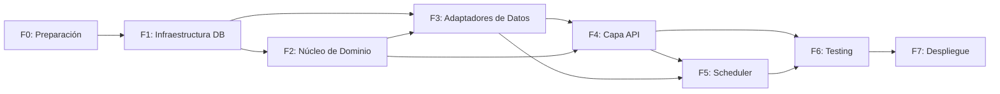

# Roadmap y Fases

**Metodología:** Spec-Driven Development (adaptable a iteraciones ágiles).

## Fases e Hitos

| Fase | Duración Estimada | Estado | Hitos Clave |
|------|-------------------|--------|-------------|
| **F0: Preparación** | 2-3 días | Completado | Estructura de proyecto, `.gitignore`, `.env.example`, `pyproject.toml`, linters, pytest + testcontainers |
| **F1: Infraestructura DB** | 3-4 días | En Progreso | Esquema normalizado (3NF), migraciones SQL, índices compuestos, seed data |
| **F2: Núcleo de Dominio** | 4-5 días | Bloqueado | Entidades `Product`/`Movement`, reglas de negocio, protocolos, casos de uso con DI |
| **F3: Adaptadores de Datos** | 3-4 días | Bloqueado | `PostgresRepository` con `asyncpg`, SQL explícito, vistas materializadas |
| **F4: Capa de Aplicación/API** | 4-5 días | Bloqueado | Rutas FastAPI, validación Pydantic, manejo de errores, OpenAPI |
| **F5: Scheduler & Concurrencia** | 2-3 días | Bloqueado | APScheduler, política de refresh, optimistic concurrency, logging |
| **F6: Testing Integral** | 3-4 días | Bloqueado | Suite unitaria, integración con Testcontainers, E2E latencia <100ms |
| **F7: Despliegue & Documentación** | 2-3 días | Bloqueado | Docker multi-stage, docker-compose, README técnico, demo script |

## Dependencias entre Fases

> Cada fase requiere aprobación explícita antes de avanzar. Desviaciones de arquitectura deben documentarse en `AGENTS.md` con justificación técnica.
