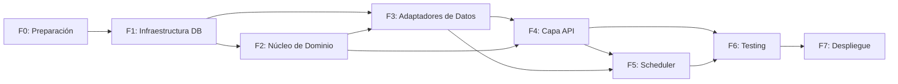

# Roadmap y Fases

**Metodología:** Spec-Driven Development (adaptable a iteraciones ágiles).

## Fases e Hitos

| Fase | Duración Estimada | Estado     | Hitos Clave |
|------|-------------------|------------|-------------|
| **F0: Preparación** | 2-3 días | Completado | Estructura de proyecto, `.gitignore`, `.env.example`, `pyproject.toml`, linters, pytest + testcontainers |
| **F1: Infraestructura DB** | 3-4 días | Completado | Esquema normalizado (3NF), migraciones SQL, índices compuestos, seed data, trigger inmutabilidad |
| **F2: Núcleo de Dominio** | 4-5 días | Completado | Entidades `Product`/`Movement`, reglas de negocio, protocols, tests unitarios (89 tests, 99.56% cobertura) |
| **F3: Adaptadores de Datos** | 3-4 días | Completado | 4 repositorios `asyncpg`, 3 mappers, `mv_stock_historical` con refresh concurrente, Unit of Work. 141 tests (100% pass), 96.30% cobertura |
| **F4: Capa de Aplicación/API** | 4-5 días | Completado | Casos de uso, validación Pydantic (`extra="forbid"`, `StrEnum`), rutas FastAPI `/v1/movements`, `/v1/stock`, `/v1/products`, manejo de errores, OpenAPI, helper `_to_output`. 235 tests (147 unit + 88 integration, 100% pass). 10 endpoints operativos. Testcontainers optimizado: 1 contenedor/session (~20s vs ~20 min). |
| **F5: Scheduler & Concurrencia** | 2-3 días | Completado | APScheduler, política de refresh, optimistic concurrency, logging estructurado |
| **F6: Testing Integral** | 3-4 días | Completado | Hypothesis PBT (100 ejemplos, seed=0), mypy --strict (74 archivos), 205 tests unitarios (99.34% cobertura), edge cases de integración, E2E con SLA p95<100ms, seguridad OWASP (SQLi + input validation + error leakage) |
| **F7: Despliegue & Documentación** | 2-3 días | Completado | Docker multi-stage (non-root, OCI labels), docker-compose prod, .env.example 17 vars, demo.sh, README v1.0.0, ARCHITECTURE.md, API_REFERENCE.md, SETUP.md, CONTRIBUTING.md, CI/CD 5 gates. Hardening: bugs criticos (statement_timeout pool-wide, race condition SELECT FOR UPDATE, dead code, naive datetime, SET LOCAL scheduler); mejoras (SecurityHeadersMiddleware, pagination DB, Clean Architecture DTOs, error handler traceback verification); 13 nuevos tests. 477 tests pass. |

## Dependencias entre Fases

> Cada fase requiere aprobación explícita antes de avanzar. Desviaciones de arquitectura deben documentarse en `AGENTS.md` con justificación técnica.
